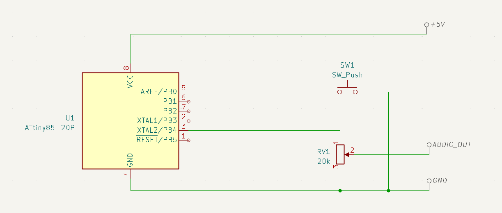
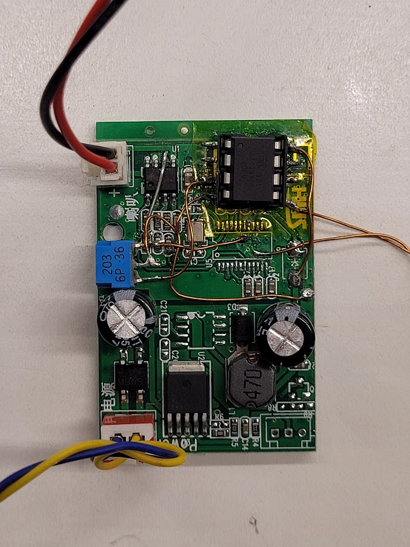

# 8-bit bike horn

Very simple bike horn that plays the different notes of the Tetris melody whenever the button is pressed.

Used a modified bluetooth receiver+amp board from a hoverboard, modified to just keep the amplifier bit. Internally it has a switching 5v regulator that can be connected to a higher voltage (e.g, a 36v ebike battery) so it can be connected directly to the microcontroller

